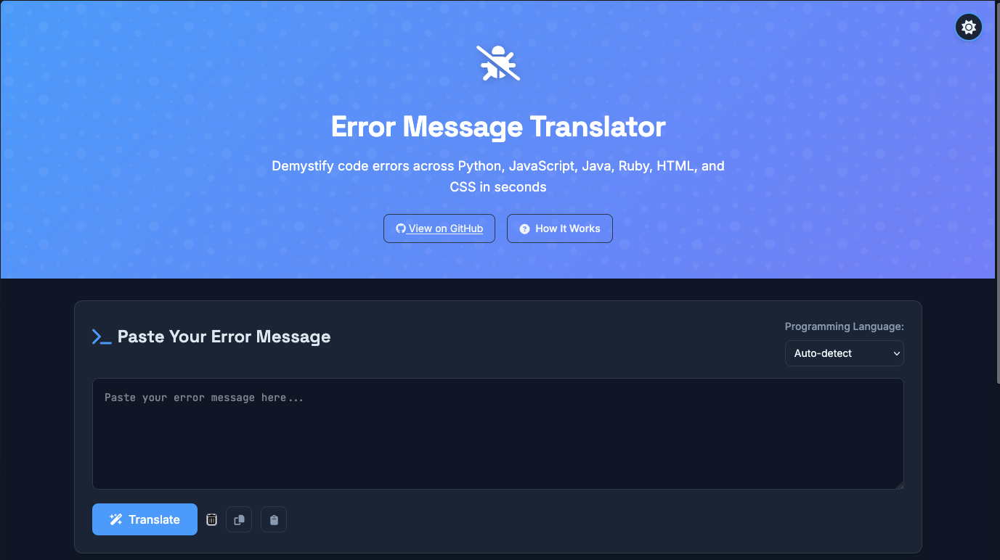

# Error Message Translator

[](https://opensource.org/licenses/MIT)
[](https://github.com/psf/black)

A web application designed to help beginner developers understand cryptic error messages by translating them into plain, understandable language with practical solutions.

> **Research Notice**: This project is for research purposes to evaluate how Large Language Models (LLMs) perform on software development projects. Everyone is welcome to contribute to this repository as part of this research test.



The Error Message Translator provides a clean, intuitive interface for translating error messages into beginner-friendly explanations.

## Features

- **Error Message Translation**: Converts complex error messages into beginner-friendly explanations
- **Multi-language Support**: Works with Python, JavaScript, HTML, and CSS errors
- **Code Examples**: Provides practical code examples showing how to fix each error
- **Copy to Clipboard**: Easily copy code solutions
- **Recent Searches**: Keep track of your recently translated errors
- **Responsive Design**: Works well on desktop and mobile devices

## Tech Stack

- **Frontend**: HTML, CSS, JavaScript
- **Backend**: Python with Flask
- **Storage**: Browser localStorage for recent searches
- **Testing**: pytest with coverage reporting
- **Code Quality**: flake8, black, pre-commit hooks

## Prerequisites

Before running this application, you need to have the following installed:

- Python 3.8 or higher
- pip (Python package manager)
- Make (optional, for using Makefile commands)

## Installation

1. Clone the repository:
   ```bash
   git clone https://github.com/chrissouk-001/error-message-translator.git
   cd error-message-translator
   ```

2. Create a virtual environment (optional but recommended):
   ```bash
   python -m venv .venv
   
   # On Windows:
   .venv\Scripts\activate
   
   # On macOS/Linux:
   source .venv/bin/activate
   ```

3. Install dependencies:
   ```bash
   # Install main dependencies
   pip install -r requirements.txt
   
   # For development, install with dev extras
   pip install -e ".[dev]"
   
   # Set up pre-commit hooks
   pip install pre-commit
   pre-commit install
   ```

## Development

This project follows standard Python development practices:

### Running the Application

```bash
# Using Python directly
python app.py

# Using the Makefile
make run
```

The application will be available at [http://localhost:5001](http://localhost:5001).

### Running Tests

```bash
# Using pytest directly
pytest

# With coverage
pytest --cov=app

# Using the Makefile
make test
```

### Code Formatting and Linting

```bash
# Check formatting with Black
black --check app tests

# Format code with Black
black app tests
# or
make format

# Run linting checks
flake8 app tests
# or
make lint
```

### Using the Makefile

The project includes a Makefile for common development tasks:

```bash
# View available commands
make help

# Run all quality checks
make lint

# Clean up Python cache files
make clean
```

## Project Structure

```
error-message-translator/
├── app/                    # Main application package
│   ├── __init__.py         # Package initialization
│   ├── data/               # Data module
│   │   └── error_patterns.py # Error pattern definitions
│   ├── static/             # Static assets
│   │   ├── css/            # Stylesheets
│   │   └── js/             # JavaScript files
│   ├── templates/          # HTML templates
│   │   └── index.html      # Main template
│   └── translator.py       # Core translation logic
├── tests/                  # Test suite
│   ├── unit/               # Unit tests
│   └── integration/        # Integration tests
├── app.py                  # Application entry point
├── setup.py                # Package setup
├── pyproject.toml          # Project configuration
├── pytest.ini              # pytest configuration
├── requirements.txt        # Dependencies
├── Makefile                # Development tasks
├── .pre-commit-config.yaml # Pre-commit hooks configuration
├── .flake8                 # flake8 configuration
├── .editorconfig           # Editor configuration
├── CHANGELOG.md            # Version changelog
├── CONTRIBUTING.md         # Contribution guidelines
├── LICENSE                 # MIT License
└── README.md               # This file
```

## TODOs

- [x] Implement additional language support (added Java)
- [ ] Enhance error detection accuracy
- [ ] Add user authentication and profile management
- [ ] Integrate with popular IDEs and code editors
- [ ] Improve mobile responsiveness and accessibility